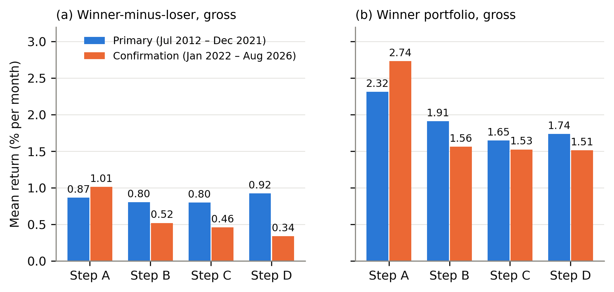
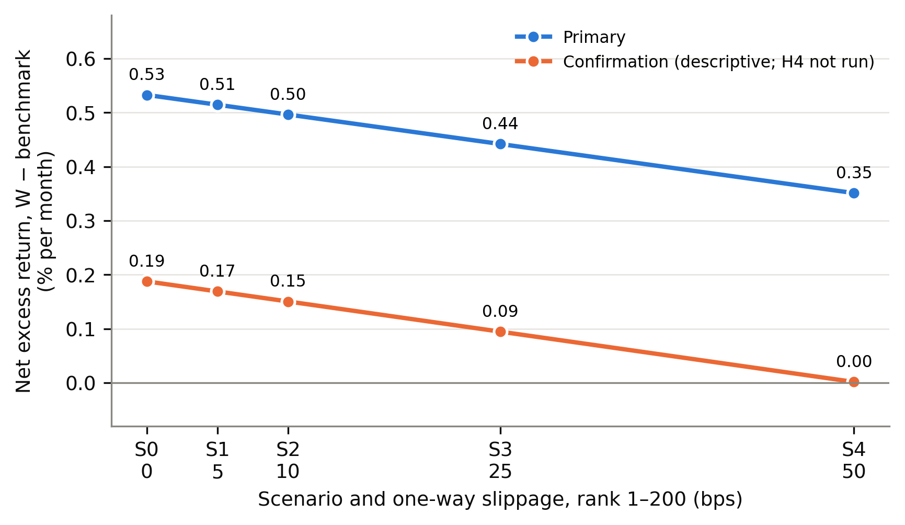
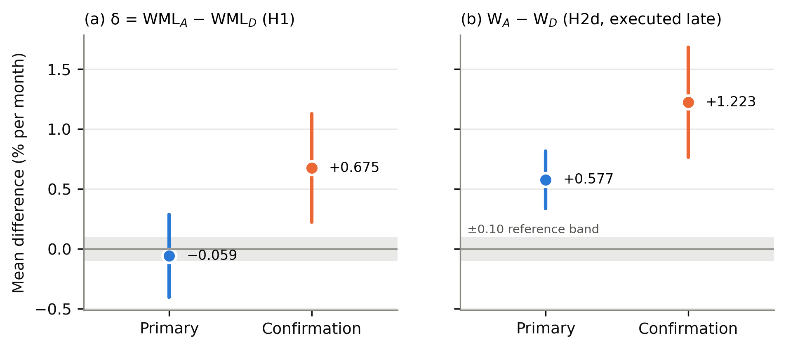
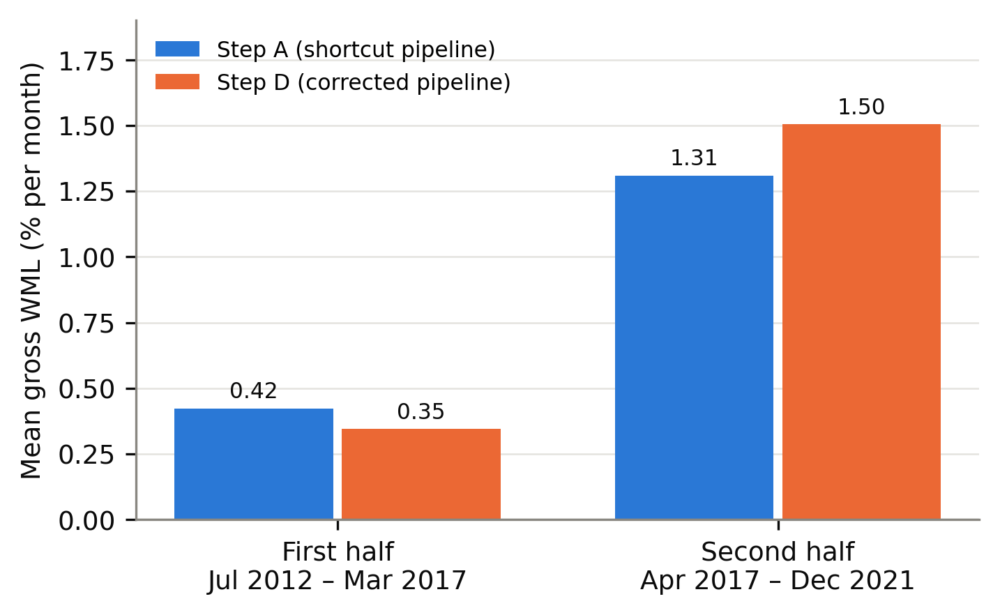
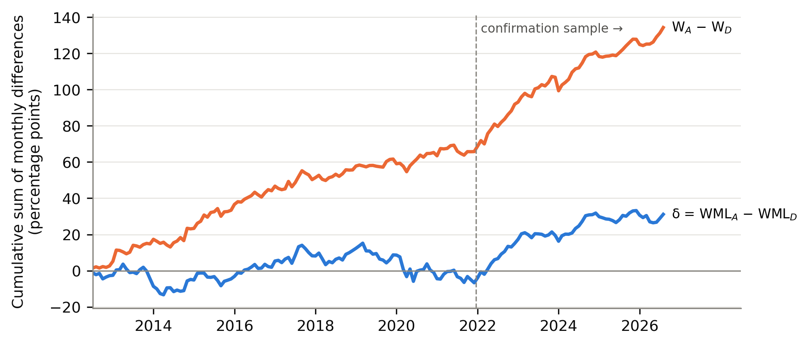

# How Much Do Historical-Data and Backtesting Shortcuts Distort Measured Cross-Sectional Momentum in Indian Equities?

**Aaditya Adhikari**
National Institute of Technology Rourkela

Working paper, October 2026. Pre-registered protocol S2-MOM-v1 (frozen 5 October 2026). Not peer reviewed.

## Abstract

Backtests of equity momentum are often built on convenient data: a list of companies that exist today, liquidity measured with hindsight, and price histories adjusted without checking each corporate action. We measure how much these shortcuts change the result of one fixed momentum design on National Stock Exchange of India (NSE) cash-market stocks. The design is a standard 12-1 strategy with one-month holding, top and bottom 30% breakpoints and equal weights, applied to the 200 most liquid stocks. A four-step ladder moves from a shortcut pipeline (step A) to a point-in-time, survivorship-aware pipeline with validated corporate-action returns (step D); a fifth step (E) deducts itemised trading costs. The protocol was frozen and hashed before any return was computed, and a later period (January 2022 to August 2026) was held back as a chronological confirmation sample.

In the primary sample (July 2012 to December 2021, 114 months), the shortcut pipeline overstates the gross winner-portfolio return by {{K/H2d/primary/mean|+.4f}}% per month (Newey–West t = {{K/H2d/primary/t|.3f}}, one-sided p = {{K/H2d/primary/p_one_sided|p}}). The same comparison in the confirmation sample gives {{K/H2d/confirmation/mean|+.4f}}% per month (t = {{K/H2d/confirmation/t|.3f}}). This result survives Holm and Benjamini–Hochberg adjustment and meets the frozen confirmation rule, but the test was executed after the main results were known and is reported as supplementary. In contrast, the pre-specified primary estimand, the change in the winner-minus-loser (WML) return between steps A and D, is {{P/H1/mean|+.4f}}% per month in the primary sample (p = {{P/H1/p_two_sided|p}}) and {{C/H1/mean|+.4f}}% in the confirmation sample (p = {{C/H1/p_two_sided|p}}), with opposite signs, so the confirmation sample does not confirm it. It is inconclusive and, under the protocol's own criteria, not reliable; the primary test could detect only effects of about {{B/detectable_effect_80pct_two_sided_5pct|.2f}}% per month. Corrected momentum is positive in the primary sample but concentrated in its second half. Several pre-registered robustness analyses were not executed; this is disclosed in full.

**Keywords:** momentum; survivorship bias; look-ahead bias; point-in-time data; backtesting; transaction costs; pre-registration; Indian equities; National Stock Exchange of India

**JEL classification (suggested):** G11, G12, G14, C58

## Plain-language summary

A momentum strategy buys stocks that have risen the most over the past year and avoids, or sells, those that have fallen the most. To test such a strategy on history, a researcher needs old data, and old data are easy to get wrong. A common mistake is to start from the companies that are large and actively traded today. Companies that failed or shrank are then missing, and the test looks better than what an investor could have earned at the time.

We built the same momentum strategy twice on Indian stocks: once with these shortcuts, and once using only information that was available on each date. We fixed every rule in writing before looking at any return.

Three things came out.

1. The shortcuts made the portfolio of past winners look better by about {{K/H2d/primary/mean|.2f}} percentage points per month in the main sample, and by about {{K/H2d/confirmation/mean|.2f}} points per month in a later check period. Much the same inflation appeared in the comparison portfolio of all stocks, so this is mostly an overstatement of returns in general, not of momentum in particular.
2. For the gap between winners and losers, which is the usual measure of momentum, we could not establish that the shortcuts changed the answer. The estimate was close to zero in the main sample and clearly positive in the later period. These two results disagree, so we do not draw a conclusion from them.
3. With the careful data, momentum was positive on average in the main sample, but almost all of it came from the second half of that sample, and it was weak in the later period.

We did not run every check that we had planned. Section 14 lists what was and was not done.

## 1. Introduction

Cross-sectional momentum, the tendency of stocks with high past returns to keep outperforming stocks with low past returns over the following months, is one of the most studied patterns in empirical finance (Jegadeesh and Titman, 1993; Carhart, 1997; Fama and French, 2012). It has been reported for Indian equities by several studies (Agarwalla, Jacob and Varma, 2013; Garg and Varshney, 2015; Chui, Ranganathan, Rohit and Veeraraghavan, 2023). This paper does not ask again whether momentum exists in India. It asks a narrower measurement question: when the same momentum design is run through a convenient historical-data pipeline and through a careful one, how different are the results?

The question matters because the convenient pipeline is common. A backtest is often built from a current list of liquid stocks, a vendor price history keyed to today's tickers, and adjustment factors applied without checking them against prices. Each of these choices uses information that was not available on the historical decision date, or drops companies that later disappeared. A reader of such a backtest cannot tell how much of the reported return comes from the strategy and how much from the pipeline.

The usual concern is survivorship bias in average returns. A momentum strategy is a harder case, because it sorts on past returns, and the errors in question (missing dead companies, hindsight liquidity selection, unvalidated corporate actions) are themselves related to past returns. The bias in a winner-minus-loser spread therefore need not have the same size, or even the same sign, as the bias in an average return. Survivorship can inflate the winner portfolio, but it also removes losers that later failed, which flatters the loser portfolio. The protocol for this study stated in advance that the direction of the net effect on the spread was not obvious, and tested it two-sided.

Our approach is a controlled ladder. The signal, dates, breakpoints, weights, timing and tests are held fixed. Four cumulative steps then change one element of the data pipeline at a time: from a survivor list chosen with 2026 liquidity (step A), to point-in-time liquidity selection among survivors (B), to a point-in-time universe that includes companies that later died (C), to validated research-grade returns (D). A separate layer (E) deducts trading costs from step D. Because every step is run on the same months, differences between steps are paired comparisons.

The study was pre-registered within the project. The protocol was frozen, hashed and committed before any return was computed; the primary sample was run once; and a later 56-month period was run once afterwards with the same code. We report four findings and one disclosure.

First, in this experiment the tested shortcuts materially inflate the measured gross return of the winner portfolio: by {{K/H2d/primary/mean|+.4f}}% per month in the primary sample and {{K/H2d/confirmation/mean|+.4f}}% per month in the confirmation sample. Second, the pre-specified primary estimand, the A-to-D change in the WML return, is inconclusive in the primary sample, has the opposite sign in the confirmation sample, and changes sign under one pre-specified sensitivity treatment. We therefore do not claim that the shortcuts distort the measured momentum spread, and we do not claim that they leave it unchanged. Third, corrected momentum (step D) is not stable over time: it is small and insignificant in the first half of the primary sample and large in the second half. Fourth, the winner-return finding survives the pre-specified multiple-testing adjustments.

The disclosure is that the study did not execute all of the robustness analyses listed in its frozen protocol, and that seven pre-registered analyses, including the winner-return test just described, were executed only after the main results were known. We treat those seven as supplementary and non-confirmatory. Section 14 sets this out in a table.

## 2. Related literature

The sources were checked to different depths, and the text below respects those limits. Three levels are used. *Full text*: the paper was read (Agarwalla, Jacob and Varma, 2013, as a working paper; Ranse, 2025). *Abstract only*: the abstract or publisher record was read, and statements here are limited to what it says. *Record only*: the bibliographic record was confirmed against the Crossref registry on 7 October 2026, but neither the abstract nor the text was read for this project, so the paper is cited for its subject as given by its title and nothing more. The reference list marks what is still unresolved, and a checklist accompanies the manuscript.

### 2.1 Momentum

Jegadeesh and Titman (1993) document that strategies which buy past winners and sell past losers earn significant positive returns over three- to twelve-month holding periods (abstract). Jegadeesh (1990) reports significant negative first-order serial correlation in monthly stock returns (abstract), which is the usual reason for skipping the most recent month when forming a momentum signal. Carhart (1997) attributes part of the persistence in mutual fund returns to the one-year momentum effect (abstract), and Fama and French (2012) study size, value and momentum in international stock returns (record only). The project protocol took its 12-1 formation window and 30% breakpoints from this line of work, but the construction details of those two papers were not checked against the originals. The one source for these design choices that was read in full is Agarwalla, Jacob and Varma (2013), who use the same window and breakpoints for India. The design was fixed from the literature and not from our own data. Barroso and Santa-Clara (2015) is cited for the topic of momentum risk (record only); we report worst months and skewness and test no risk-management rule.

### 2.2 Survivorship and delisting bias

Shumway (1997) documents a delisting bias in a widely used US return database: correct delisting returns are missing for most stocks delisted for negative reasons, and the omitted returns are large (abstract). We apply −30% to non-voluntary delistings as a stated assumption. The protocol attributes this figure to Shumway (1997); the figure is not in the abstract and has not been checked against the paper, so it should be read as our assumption and not as a cited estimate. For India, two recent working papers measure survivorship bias in universe-level returns. Ranse (2025), which was read in full, reconstructs the NIFTY Smallcap 250 from NSE daily files for 2016 to 2025 and reports that a survivor-only equal-weight portfolio overstates the annual return by 4.94 percentage points. That paper does not study momentum or any return-sorted strategy, and it names strategy-specific survivorship bias as future work. Jain (2026) compares survivor and point-in-time top-500 Indian universes in paired backtests and reports a bias of 0.8 to 3.3 percentage points per year that depends on the universe vintage and the survivor filter (abstract only). The full text could not be obtained: the SSRN page and file refused access again on 7 October 2026. The abstract does not mention momentum, costs, corporate actions or a held-back period, and the author's public code repository describes the result as an inflation of equal-weight returns. On this evidence the paper measures survivorship bias in universe-level returns. Whether its full text contains a momentum-specific experiment remains unresolved.

### 2.3 Data snooping and backtest overfitting

A reported backtest is usually the survivor of many attempted specifications. McLean and Pontiff (2016) study 97 published return predictors and report that portfolio returns are lower out of sample and lower again after publication (abstract). Harvey, Liu and Zhu (2016) argue that a newly proposed factor should clear a t-ratio above 3.0 (abstract of the working-paper version). White (2000) and Romano and Wolf (2005) are cited for tests that account for a search over specifications, and Bailey and López de Prado (2014) for a Sharpe ratio corrected for selection bias and backtest overfitting (record only for all three). Our response to this literature is procedural: one primary specification, fixed before any return was computed, with a registry of every specification that was run. The specification-search adjustments were planned for a formation-and-holding grid that was not executed (Section 14), so they are not reported.

### 2.4 Transaction costs

Korajczyk and Sadka (2004) test whether momentum strategies remain profitable after trading costs, using intraday data to estimate proportional and price-impact costs, and compute break-even fund sizes (abstract). Lesmond, Schill and Zhou (2004) is cited on the same question (record only). Corwin and Schultz (2012) derive a bid-ask spread estimator from daily high and low prices (abstract), and Abdi and Ranaldo (2017) one from daily close, high and low prices (record only); these estimators were planned as a robustness analysis and were not executed. We do not have quote or order-book data, so execution cost enters only as pre-specified scenarios, and statutory and broker charges are itemised from archived sources.

### 2.5 Indian momentum evidence

Agarwalla, Jacob and Varma (2013), read in full as a working paper, construct size, value and momentum factors for the Bombay Stock Exchange from 1993, with a 12-1 momentum definition, 30% breakpoints and an explicit correction for firms that stopped trading. This means that a survivorship-adjusted Indian momentum factor already exists. According to their abstracts, Chui et al. (2023) study momentum, reversals and liquidity for 3,956 BSE stocks over 2000 to 2021; Garg and Varshney (2015) study formation and holding periods in four sectors of the CNX 500 from 2000 to 2013; Das and Barai (2016) test size, value and momentum factors; Nigam and Pandey (2023) compare long-only momentum variants; and Raju (2023) studies the number of holdings and the universe size. Raju and Chandrasekaran (2019) study a long-only momentum strategy on NIFTY 100 constituents, report that the result survives costs at discount-broker rates, and, as recorded by the project reviewer from the accessible text, include delisted stocks. The methods of these papers, other than Agarwalla et al., have not been verified from the full texts.

### 2.6 Research gap and bounded contribution

The existence of momentum in Indian equities, liquidity-conditioned momentum, long-only momentum after costs, and survivorship-adjusted momentum data are all in the prior literature, and none is claimed here as a contribution. What this study adds is a controlled, sequential measurement of how several historical-data corrections change one fixed momentum design, with costs layered separately and a later period held back.

Within the literature reviewed for this study, we did not identify a directly comparable design combining the specific A–D correction ladder, the separate transaction-cost layer, and an untouched chronological confirmation sample. This is a bounded literature-positioning statement, not a claim of exhaustive uniqueness. The statement rests on full texts for two of the nine Indian papers and on abstracts for the other seven. In particular, no exclusive claim is made against Jain (2026): its abstract indicates a study of universe-level survivorship bias, but its full text could not be obtained and the question remains unresolved.

## 3. Research question and hypotheses

**Research question.** How much do common historical-data and backtesting shortcuts distort measured cross-sectional momentum in Indian equities?

All hypotheses were fixed in the frozen protocol. Let W, L and BM denote the monthly returns of the winner portfolio, the loser portfolio and the equal-weighted benchmark of all ranked stocks, let WML = W − L, and let a subscript denote the ladder step.

- **H1 (primary).** The mean of δ(t) = WML<sub>A</sub>(t) − WML<sub>D</sub>(t) differs from zero. Two-sided, α = 0.05. An ex-ante reference threshold of ±0.10% per month is used to describe the size of the effect; it is a reference level fixed before any result; other investors or universes could reasonably use a different level.
- **H2a–H2c (decomposition).** The means of WML<sub>A</sub> − WML<sub>B</sub>, WML<sub>B</sub> − WML<sub>C</sub> and WML<sub>C</sub> − WML<sub>D</sub> differ from zero. Two-sided.
- **H2d (winner inflation).** The mean of W<sub>A</sub> − W<sub>D</sub> is positive. One-sided, the standard survivorship prediction. H2a–H2d form one Holm family at α = 0.05.
- **H3 (existence).** The mean of gross WML<sub>D</sub> is positive. One-sided.
- **H4 (survival), tested only if H3 is supported.** The mean of W<sub>E</sub> − BM<sub>E</sub>, net of statutory and broker costs with no slippage, is positive. One-sided.
- **H5 (liquidity).** WML differs between liquidity ranks 1–200 and 201–500. This test was pre-registered and was not executed.

H1 was the test designed to carry the headline. H2d was a secondary test. The paper keeps that ordering when it weighs the evidence, even though H2d produced the clearer result.

## 4. Data and point-in-time universe

**Source and coverage.** The data are NSE cash-market daily records for the EQ series, for the verified period 22 June 2011 to 30 September 2026, held in the project's Stage 2 research datasets. Only companies are included (ISIN beginning INE); fund units are excluded. No vendor-adjusted prices, no intraday data and no data after 30 September 2026 are used. The Stage 2 build must pass 150 integrity checks before the study can run.

**Returns.** The return dataset (RET-1.1) holds, for every stock-day, a raw close-to-close return and a research-grade return. The research-grade return adjusts only for bonuses and splits whose recorded factor is validated against the price on the ex-date. Rows affected by unvalidated or unparsed corporate actions, multi-session gaps, unexplained jumps or large residuals are flagged as not research-grade and carry no research return. Returns are price returns; dividends are not included.

**Point-in-time universe.** The universe dataset (UNIV-1) ranks, at each month-end selection date, all eligible companies by the median daily traded value over the preceding 63 sessions, requiring at least 50 valid sessions. The 200 most liquid are members on that date. The ranking uses nothing dated after the selection date, and companies that later stopped trading remain in the history.

**Identity.** The identity dataset (ID-1) links symbol and ISIN changes of the same company using dated evidence. In the corrected pipeline a link is used only from the date it takes effect.

**Samples.** The first selection date is 29 June 2012 and the last is 31 July 2026, giving 170 one-month holding periods. The primary sample is July 2012 to December 2021 (114 months). The confirmation sample is January 2022 to August 2026 (56 months). The boundary was set at a calendar-year end tied to the sample end of the most recent closely related published paper, before any return was computed.

**What the data cannot support.** There is no market capitalisation in the data, so portfolios are equal-weighted and there is no size control or factor-model alpha. There are no dividends, no quotes and no risk-free rate series.

**Sample size in step D.** The number of ranked stocks per month in step D has a minimum of {{P/reliability/rankable_min|d}} and averages {{P/reliability/rankable_mean|.1f}} in the primary sample and {{C/reliability/rankable_mean|.1f}} in the confirmation sample, so each of the winner and loser portfolios holds roughly 56 stocks. The neutral fill for bad holding-period data (Section 5.4) was applied to {{P/reliability/filled_share_of_W_stock_days|x100|.3f}}% of winner stock-days and {{P/reliability/filled_share_of_L_stock_days|x100|.3f}}% of loser stock-days in the primary sample, far below the 5% level at which the protocol would label the results unreliable.

## 5. Experimental design

### 5.1 The A–D ladder and the E cost layer

**Table 1. The experimental ladder.** Steps are cumulative; each changes one element. Steps A, B and C contain look-ahead on purpose. They measure error and are not used as evidence about momentum.

| Step | The one change from the step before | Universe at selection date t | Returns | Costs |
|---|---|---|---|---|
| A. Shortcut baseline | — | The 200 most liquid companies that are still active on 30 September 2026, ranked by liquidity measured at that date. One fixed list for every month | Raw returns; every recorded bonus or split factor applied without validation; gaps, jumps and special-session spans used as they are | None |
| B. Point-in-time liquidity | Liquidity is measured at t instead of at 30 September 2026 | The 200 most liquid at t among companies still active in 2026 | As A | None |
| C. Survivorship and identity | The survivor restriction is dropped; identity links are used only once effective | The 200 most liquid at t among all companies, including those that later died (UNIV-1 members) | As A, plus the delisting rule | None |
| D. Corrected gross specification | Research-grade returns and data-quality rules | As C; a stock is ranked only if every formation-window row is research-grade | Research-grade returns | None |
| E. Cost layer | Costs deducted from step D | As D | As D | Itemised statutory, exchange and broker charges, plus slippage scenarios S0–S4 |

The ladder is a sequential decomposition. The total change from A to D does not depend on the order of the intermediate steps, but the size of each intermediate step does, and the steps are not claimed to be independent causal effects of each shortcut. Step A is one precisely defined shortcut pipeline built from the project's own files. It imitates a common practice; it is not a copy of any data vendor's product.

### 5.2 Formation and holding rules

At each month-end selection date t, stocks are ranked on the compounded daily return from the first session after the month-end twelve months earlier to the month-end one month earlier (the 12-1 signal). The most recent month is skipped. With n ranked stocks, the winner portfolio W is the top k = floor(0.30 n + 0.5) and the loser portfolio L is the bottom k; ties are broken by a fixed identifier. Positions are entered at the close of the first session after t, one full session after every input is fixed, and are held until the close of the first session after the next selection date. Holding periods do not overlap. Portfolios are equal-weighted at entry and weights drift within the month.

### 5.3 Universe construction

Steps C, D and E use the UNIV-1 members at t. Steps A and B use the survivor variants in Table 1. The benchmark in every step is the equal-weighted portfolio of all stocks ranked in that step, with the same timing and return rules.

### 5.4 Return construction

In step D, market-wide special-session days are left out of every stock's formation and holding returns, so the cross-sectional ranking still compares like with like. A stock with any other non-research-grade row in its formation window is not ranked that month; this is known a month before the decision. A stock is not removed after selection because its data turned bad: on such a holding day its return is replaced by the same-day return of the other stocks in its portfolio. A held stock that stops trading is carried at its last price; if it never trades again, a voluntary delisting is booked at 0% and a compulsory delisting, liquidation or unexplained ending at −30%.

### 5.5 Leakage checks

Three checks had to pass on real data before any result was produced, and all passed in both samples: a perturbation test (changing data dated after t leaves the portfolios chosen at t unchanged), a truncation test, and a placebo test in which a random ranking replaces the momentum ranking (two-sided p for a non-zero random WML: {{QP/placebo/p_two_sided_of_random_wml|.3f}} in the primary sample and {{QC/placebo/p_two_sided_of_random_wml|.3f}} in the confirmation sample).

### 5.6 The cost layer

Costs are deducted from the saved step-D holdings; step E changes no gross result. Class 1 costs are the charges billed to a retail individual account at one discount broker (Zerodha) on NSE delivery trades: securities transaction tax, exchange transaction charge, investor-protection contribution, SEBI turnover fee, stamp duty, brokerage, indirect tax on charges, and a flat depository charge per stock sold. Each follows a dated schedule built from archived sources. Where a historical rate could not be evidenced after a documented search, the current rate is applied to the whole period and labelled an assumption; this applies to securities transaction tax (0.1% on each side throughout), to stamp duty before 1 July 2020 and to the investor-protection contribution before 1 April 2023. Each portfolio is valued at ₹1 crore at every rebalance.

Class 2 cost is slippage, for which we have no measurement. Five scenarios were fixed in the protocol: S0 (none), and S1 to S4 with one-way slippage of 5, 10, 25 and 50 basis points for stocks ranked 1–200 by liquidity and three times as much for stocks ranked 201–500. They are scenarios chosen to span a range. None is an estimate and none is described as realistic. H4 uses S0.

The cost rules were specified after the gross results of steps A–D were known and before any cost, turnover or net return was computed. The loser portfolio cannot be sold short and held overnight in the cash market, so every net figure for L and for WML is hypothetical: L is costed as if it were a long portfolio, and the net WML is not tested.

## 6. Statistical methodology

**Newey–West inference.** Every test is a test of the mean of a monthly series, either a return or a paired difference, with Newey–West (1987) standard errors. The lag is fixed by floor(4 (T/100)<sup>2/9</sup>): four for 114 and for 170 months, three for 56 and for 57 months. P-values and 90% confidence intervals use the standard normal distribution.

**Bootstrap.** A stationary bootstrap (Politis and Romano, 1994) with 10,000 resamples, automatic block length and a fixed seed was specified as a robustness check for all tests. It was executed for H1 only. No bootstrap result is reported for any other test.

**Blinded precision.** Before the mean of δ was displayed, the code recorded only its dispersion. The monthly standard deviation of δ is {{B/sd|.3f}}% and its Newey–West long-run standard deviation is {{B/long_run_sd_nw|.3f}}%, which implies that the smallest effect detectable with 80% power in a two-sided 5% test is {{B/detectable_effect_80pct_two_sided_5pct|.3f}}% per month. This is about six times the ±0.10% reference threshold. The primary test was therefore known to be imprecise before it was unblinded, and its power to show that the distortion is immaterial was recorded as {{B/equivalence_power_at_true_zero|.1f}}.

**Decision rule for H1.** The distortion is "detected and material" if H0 is rejected and the 90% interval lies wholly outside ±0.10%; "immaterial" if the interval lies wholly inside ±0.10%; otherwise the result is an estimate with its interval, labelled inconclusive.

**Multiple testing.** H1 is a single primary test. H2a–H2d are adjusted by the Holm (1979) step-down procedure at a family level of 0.05. H3 and H4 are a fixed sequence. Benjamini–Hochberg (1995) q-values are shown for the secondary tests for information; they decide no hypothesis. Because H5 was not executed, the Benjamini–Hochberg family has six members where seven were planned.

**Reliability criteria.** The protocol labels a result "not reliable" if any month has fewer than 100 ranked stocks in step D or the average is below 150; if more than 5% of winner or loser stock-days are filled; or if H1, H3 or H4 changes sign or significance under the span, gap, missing-day or delisting sensitivity treatments.

**Confirmation rule.** For each tested quantity, the confirmation sample gives one of three outcomes fixed in advance: confirmed (same sign as in the primary sample and significant at the same level), consistent but not confirmed (same sign, not significant), or not confirmed (opposite sign). The confirmation period is a later period run once with the same code. It is not an independently designed experiment: it shares the market, the pipeline, the researcher and the specification.

## 7. Primary results

**Table 2. Primary sample, July 2012 to December 2021 (114 months).** Panel A: mean gross monthly return in percent, Newey–West t-statistic in parentheses. Steps A, B and C are biased by construction.

{{@LADDER_P}}

Panel B: hypothesis tests. H2d was executed late (Section 10). "n/r" means the interval is not in the registered file.

{{@TESTS_P}}



**Figure 1. Mean gross monthly return across ladder steps A–D.** Panel (a): winner-minus-loser. Panel (b): winner portfolio. Steps A–C are biased by construction and measure error.

**The primary estimand.** The mean of δ is {{P/H1/mean|+.4f}}% per month, with a Newey–West standard error of {{P/H1/se_nw|.4f}} (t = {{P/H1/t|.3f}}, two-sided p = {{P/H1/p_two_sided|p}}). The 90% confidence interval, {{P/H1/ci90/0|+.3f}} to {{P/H1/ci90/1|+.3f}}% per month, contains zero and extends beyond the ±0.10% reference threshold on both sides. Under the frozen decision rule the result is INCONCLUSIVE. The stationary bootstrap gives the same reading (two-sided p = {{P/H1_bootstrap/p_two_sided|p}}). The data do not show that the shortcuts changed the measured WML return in this sample, and they are equally unable to show that the change was immaterial.

**The decomposition.** None of the three step differences on WML is distinguishable from zero (Table 2, H2a–H2c), and none is rejected after Holm adjustment.

**Winner inflation.** The picture is different for the level of the winner return. The mean gross winner return falls from {{P/ladder/A/W/mean_pct|.3f}}% per month in step A to {{P/ladder/D/W/mean_pct|.3f}}% in step D. The paired difference W<sub>A</sub> − W<sub>D</sub> has a mean of {{K/H2d/primary/mean|+.4f}}% per month, with a Newey–West standard error of {{K/H2d/primary/se_nw|.4f}} (t = {{K/H2d/primary/t|.3f}}, one-sided p = {{K/H2d/primary/p_one_sided|p}}; 90% CI {{K/H2d/primary/ci90/0|+.3f}} to {{K/H2d/primary/ci90/1|+.3f}}% per month). The whole interval lies above the +0.10% reference threshold.

**Table 3. Multiple-testing adjustment for the secondary tests, primary sample.** Holm family: H2a–H2d. Benjamini–Hochberg family: the six secondary tests that were executed; H5 was pre-registered, was not executed and is absent, so the planned family size was seven. The adjustments were computed late (Section 10).

{{@MULTIPLE}}

H2d is rejected after Holm adjustment (adjusted p = {{K/holm/H2d/p_holm|p3}}) and has a Benjamini–Hochberg q-value of {{K/benjamini_hochberg/H2d/q|p3}}. It is the only member of the Holm family that is rejected.

**Existence of corrected momentum.** Gross WML in step D averages {{E/samples/primary/H3/mean_pct|.3f}}% per month (t = {{E/samples/primary/H3/t|.3f}}, one-sided p = {{E/samples/primary/H3/p_one_sided|p}}), so H3 is supported at the 5% level in the primary sample. The t-statistic is below the stricter threshold of 3.0 proposed by Harvey, Liu and Zhu (2016), and the protocol stated in advance that this test is underpowered. Section 10 shows that the result is not stable across the two halves of the sample.

**Sensitivity and reliability.** Six sensitivity treatments were run on the primary sample (Appendix Table A1). Under five of them δ keeps its negative sign. Under the treatment that restores the raw two-session return on special-session days, the mean of δ becomes {{S/sensitivity/R_SPAN/H1/mean|+.4f}}% per month: still insignificant, but of the opposite sign. A change of sign under this treatment meets the protocol's third reliability criterion, so H1 carries the label NOT RELIABLE. The label applies to H1. H3 did not change sign or significance under any of the six treatments. The sensitivity of H4 to these treatments was not computed and is unknown. In the reverse-order ladder, where one correction at a time is switched back starting from step D, neither difference in WML is distinguishable from zero (Appendix Table A2).

## 8. Transaction-cost results

**Table 4. Step E: costs and net returns under the five slippage scenarios, percent per month.** Statutory and broker charges are included in every scenario. Net WML is hypothetical (the loser portfolio is costed as a long portfolio) and is not tested. Confirmation-sample figures are descriptive: H4 and the break-even cost were not run for that sample.

{{@COSTS}}



**Figure 2. Net excess return of the winner portfolio over the benchmark under slippage scenarios S0–S4.** The horizontal axis shows the one-way slippage for stocks ranked 1–200; stocks ranked 201–500 pay three times as much. The scenarios are assumptions fixed in advance, not estimates of realised execution cost.

In the primary sample the winner portfolio has a mean one-way turnover of {{E/samples/primary/mean_one_way_turnover/W|x100|.1f}}% per month, against {{E/samples/primary/mean_one_way_turnover/BM|x100|.1f}}% for the benchmark. With statutory and broker charges only (S0), costs reduce the winner return by {{E/samples/primary/scenarios/S0/cost_W|x100|.3f}}% per month and the benchmark return by {{E/samples/primary/scenarios/S0/cost_BM|x100|.3f}}%.

**H4.** The net excess return of the winner portfolio over the benchmark under S0 averages {{E/samples/primary/H4/mean_pct|.4f}}% per month (Newey–West standard error {{E/samples/primary/H4/se_nw_pct|.4f}}, t = {{E/samples/primary/H4/t|.3f}}, one-sided p = {{E/samples/primary/H4/p_one_sided|p}}). H4 is supported in the primary sample under S0. Following the protocol, the claim is limited to a break-even statement: under the specified construction, the net excess return in the primary sample remains positive up to a uniform one-way cost of about {{E/samples/primary/break_even/break_even_one_way_cost_bps|.0f}} basis points. Under S4, the most severe scenario, the mean net excess return is {{E/samples/primary/scenarios/S4/net_excess_W_over_BM|x100|.3f}}% per month.

Four qualifications apply to every figure in this section.

1. Several cost inputs rest on assumptions listed in Section 5.6. The retail-account assumption gives zero delivery brokerage from 1 December 2015, and the stamp-duty fallback omits sell-side duty before July 2020. Both may favour the strategy.
2. A flat rupee charge per stock sold weighs more on a portfolio that holds more stocks. The benchmark holds about three times as many stocks as the winner portfolio, so this charge lowers the benchmark's net return by more, which raises the winner portfolio's net excess return. This follows from the frozen per-portfolio notional and may favour the survival result.
3. The sensitivity of H4 to the span, gap, missing-day and delisting treatments is unknown, because those treatments were not run for step E.
4. Each sample starts from cash and has no terminal liquidation.

In the confirmation sample H3 is not supported (Section 9), so by the fixed sequence H4 and the break-even cost were not run. The descriptive figures in Table 4 show a mean net excess return of {{E/samples/confirmation/scenarios/S0/net_excess_W_over_BM|x100|.3f}}% per month under S0, which falls to {{E/samples/confirmation/scenarios/S4/net_excess_W_over_BM|x100|.3f}}% under S4. The hypothetical net WML is negative under S3 and S4 in that sample. No test supports a survival claim for the confirmation period.

## 9. Confirmation results

**Table 5. Confirmation sample, January 2022 to August 2026 (56 months).** Panel A: mean gross monthly return in percent, Newey–West t-statistic in parentheses (lag 3). Steps A, B and C are biased by construction.

{{@LADDER_C}}

Panel B: hypothesis tests and confirmation status under the frozen rule.

{{@TESTS_C}}



**Figure 3. Primary against confirmation sample: mean and 90% confidence interval.** Panel (a): the primary estimand δ. Panel (b): the winner-return difference tested by H2d. The shaded band is the ±0.10% per month reference threshold.

**The primary estimand is not confirmed.** In the confirmation sample the mean of δ is {{C/H1/mean|+.4f}}% per month (Newey–West standard error {{C/H1/se_nw|.4f}}, t = {{C/H1/t|.3f}}, two-sided p = {{C/H1/p_two_sided|p}}; 90% CI {{C/H1/ci90/0|+.3f}} to {{C/H1/ci90/1|+.3f}}; bootstrap p = {{C/H1_bootstrap/p_two_sided|p}}). The sign is opposite to that of the primary sample. Under the frozen rule the status is NOT CONFIRMED. Taken alone, the confirmation-sample estimate would indicate that the shortcut pipeline inflates the WML return; taken with the primary sample, the two periods disagree. H1 therefore remains INCONCLUSIVE in the primary sample, NOT RELIABLE under the protocol's sensitivity criterion, and NOT CONFIRMED in the later period. The registered confirmation file carries a code-generated label "MATERIAL" for this estimate. That label applies a decision rule that the protocol defines for the primary sample only, and it is not a registered conclusion.

The protocol warned that the size of δ was expected to differ between periods, because the step-A list is fixed at September 2026 and is therefore closer in time to the confirmation months. It specified the sign rule for that reason, and it is the sign rule that fails.

**Winner inflation is confirmed.** The mean of W<sub>A</sub> − W<sub>D</sub> in the confirmation sample is {{K/H2d/confirmation/mean|+.4f}}% per month, with a Newey–West standard error of {{K/H2d/confirmation/se_nw|.4f}} (t = {{K/H2d/confirmation/t|.3f}}, one-sided p = {{K/H2d/confirmation/p_one_sided|p}}; 90% CI {{K/H2d/confirmation/ci90/0|+.3f}} to {{K/H2d/confirmation/ci90/1|+.3f}}% per month). It has the same sign as in the primary sample and is significant at the same level, which satisfies the frozen rule for CONFIRMED. The test was executed late in both samples.

**Corrected momentum is weak in the later period.** Gross WML in step D averages {{E/samples/confirmation/H3/mean_pct|.3f}}% per month in the confirmation sample (t = {{E/samples/confirmation/H3/t|.3f}}, one-sided p = {{E/samples/confirmation/H3/p_one_sided|p}}). H3 is supported in the primary sample, but the confirmation sample does not provide significant evidence for the same effect.

**The ladder in the later period.** In the confirmation sample most of the fall in the WML return occurs at the first step: WML is {{C/ladder/A/WML/mean_pct|.3f}}% per month in step A and {{C/ladder/B/WML/mean_pct|.3f}}% in step B. The A−B difference is {{C/step_differences_pct/A-B/mean|+.3f}}% (two-sided p = {{C/step_differences_pct/A-B/p_two_sided|p}}, unadjusted). No multiple-testing family was defined for the confirmation sample, so this is descriptive. Under the protocol's fixed rule, momentum is "detected" in step A and not in steps B, C or D in this sample: the shortcut pipeline and the corrected pipeline give different economic readings of the same months.

## 10. Supplementary C2 findings

The analyses in this section were pre-registered in the frozen protocol but executed on 7 October 2026, after the primary, sensitivity, confirmation and cost results were known. They were computed from the saved registered monthly files under a separate specification that was written and hashed before any of them was calculated; no backtest was rerun. They are not blind and not confirmatory. The H2d test and the adjustments in Table 3 belong to this set as well.

### 10.1 Halves of the primary sample

**Table 6. The two halves of the primary sample (57 months each, Newey–West lag 3).** Executed late; descriptive.

{{@HALVES}}



**Figure 4. Mean gross WML in the two halves of the primary sample, step A and step D.**

Corrected momentum is concentrated in the second half. Step-D WML averages {{K/blocks/primary_half_1/ladder/D/WML/mean_pct|.3f}}% per month in the first half (two-sided p = {{K/blocks/primary_half_1/ladder/D/WML/p_two_sided|.3f}}) and {{K/blocks/primary_half_2/ladder/D/WML/mean_pct|.3f}}% per month in the second half (p = {{K/blocks/primary_half_2/ladder/D/WML/p_two_sided|.3f}}). The full-sample support for H3 comes almost entirely from April 2017 to December 2021. Together with the weak confirmation-sample estimate, this shows that corrected momentum in this universe is temporally unstable over the periods examined. The second-half estimate is one of two halves of one sample. It is not evidence of a general or lasting premium, and we make no general profitability claim from it.

The primary estimand is insignificant in both halves ({{K/blocks/primary_half_1/delta/mean|+.3f}}% and {{K/blocks/primary_half_2/delta/mean|+.3f}}% per month), with different signs. The halves were not used for H2d. One unadjusted step difference stands out in the first half (C−D, {{K/blocks/primary_half_1/step_differences_pct/C-D/mean|+.3f}}% per month, t = {{K/blocks/primary_half_1/step_differences_pct/C-D/t|.2f}}); it belongs to no tested family, is absent in the second half ({{K/blocks/primary_half_2/step_differences_pct/C-D/mean|+.3f}}%), and we do not interpret it.

### 10.2 Pooled descriptive analysis

Over the pooled 170 months (Appendix Table A3), the mean of δ is {{K/blocks/pooled/delta/mean|+.3f}}% per month (two-sided p = {{K/blocks/pooled/delta/p_two_sided|p}}) and step-D WML averages {{K/blocks/pooled/ladder/D/WML/mean_pct|.3f}}% per month (t = {{K/blocks/pooled/ladder/D/WML/t_nw|.2f}}). The protocol fixed the pooled sample as descriptive only; it is not confirmatory. It averages two periods whose results differ and is shown for completeness.

### 10.3 Skewness

Momentum returns are negatively skewed in the primary sample. Step-D WML has a skewness of {{K/blocks/primary/ladder/D/WML/skewness|.2f}}, and the step-D winner portfolio {{K/blocks/primary/ladder/D/W/skewness|.2f}} (Appendix Table A4). In the confirmation sample the skewness of step-D WML is {{K/blocks/confirmation/ladder/D/WML/skewness|.2f}}.

### 10.4 Worst month

The worst month for step-D WML in the primary sample is {{K/blocks/primary/ladder/D/WML/worst_month|s}}, at {{K/blocks/primary/ladder/D/WML/worst_month_pct|.2f}}%; this is the worst winner-minus-loser month, not a loss that a cash-market investor could have realised. The worst month for the step-D winner portfolio is {{K/blocks/primary/ladder/D/W/worst_month|s}}, at {{K/blocks/primary/ladder/D/W/worst_month_pct|.2f}}%. The maximum drawdown of step-D WML over the primary sample is {{P/ladder/D/WML/max_drawdown_pct|.1f}}%. A mean return of under one percent per month sits beside single-month losses of twenty percent or more.



**Figure 5. Cumulative sums of the registered monthly differences, July 2012 to August 2026.** Descriptive only; plotted from the registered monthly files. The winner-return difference accumulates steadily, while δ drifts without direction in the primary sample and rises in the confirmation sample.

## 11. Discussion

The evidence supports one statement clearly and leaves another open.

The clear statement concerns levels. In this experiment, the shortcut pipeline reports a higher winner-portfolio return than the corrected pipeline in both samples, by a margin that is large relative to its standard error and that lies above the pre-specified reference threshold. H2d is the strongest methodological finding of this study, and it is a shortcut-comparison finding: it concerns the inflation of measured winner-portfolio returns caused by the tested shortcuts. It says nothing on whether momentum is real, and it is not evidence that momentum is produced by the shortcuts.

The open statement concerns the spread. The estimand that the protocol put first, the A-to-D change in WML, did not give a usable answer. It is near zero and imprecise in the primary sample, positive and significant in the confirmation sample, of opposite signs in the two, and sign-sensitive to one pre-specified treatment. The blinded precision step had already shown that the primary test could detect only effects several times larger than the reference threshold. The honest reading is that this design, at this sample size, could not determine whether the shortcuts distort the measured momentum spread.

These two statements are compatible. A pipeline can overstate the return of every portfolio it builds by a similar amount, and such a common overstatement cancels in a long-short difference. Section 12 relates this to the registered step means.

Two features of how the evidence was produced limit its weight. The winner-return test was pre-registered as a secondary hypothesis, but its standard error and p-value were computed only after all other results were known, and the sign and size of its mean were already visible from the registered step means. The decision to compute it was not blind. It is offered some protection by having been pre-specified in the frozen protocol with its direction, by the fixed Newey–West procedure, and by the fact that it passes in both samples; it is still not a confirmatory result in the strict sense. Second, the study did not execute the larger part of its planned robustness set, so the dependence of every result on formation period, breakpoints, weighting, entry timing and cost assumptions is unknown.

## 12. Economic interpretation

The registered step means in Tables 2 and 5 help to locate the winner inflation. This section adds no new statistic.

In the primary sample, the move from step A to step D lowers the mean return of every portfolio the pipeline builds. The winner portfolio falls from {{P/ladder/A/W/mean_pct|.3f}}% to {{P/ladder/D/W/mean_pct|.3f}}% per month, the loser portfolio from {{P/ladder/A/L/mean_pct|.3f}}% to {{P/ladder/D/L/mean_pct|.3f}}%, and the benchmark of all ranked stocks from {{P/ladder/A/BM/mean_pct|.3f}}% to {{P/ladder/D/BM/mean_pct|.3f}}%. The three falls are of similar size, and the tested spread difference δ is correspondingly close to zero. In the primary sample, then, the shortcut pipeline raised the level of returns for winners, losers and the benchmark alike. This is what one would expect if the main effect of the shortcuts is to select companies that turned out to do well, whatever their momentum rank. For a reader of an existing backtest, the practical point is limited to what was tested: the winner return was overstated, and so was the return of a benchmark built from the same shortcut list. No test in this study compares the two overstatements.

The confirmation sample differs. There the winner portfolio falls from {{C/ladder/A/W/mean_pct|.3f}}% to {{C/ladder/D/W/mean_pct|.3f}}% per month between step A and step D, while the loser portfolio falls from {{C/ladder/A/L/mean_pct|.3f}}% to {{C/ladder/D/L/mean_pct|.3f}}%. The fall is larger for winners than for losers, so it does not cancel in the spread, and most of the change in WML arises at the first step of the ladder (Table 5). One possible reason, which the study did not test, is proximity: the step-A list is the set of stocks that were most liquid in September 2026, and stocks that became liquid by then are likely to include those that rose strongly in the few years before. Hindsight selection of that kind would load directly on recent winners. This remains a conjecture.

On costs, the primary-sample result is that the winner portfolio's advantage over an equally costed benchmark was not removed by statutory and broker charges, and that the pre-specified slippage scenarios reduce it without eliminating it. This is a statement about one sample under one cost construction with the stated assumptions. It was not tested in the confirmation sample, where the gross advantage was already small.

Nothing here supports a general claim that momentum in Indian equities is profitable or unprofitable. The corrected WML return is positive on average over 170 months, significant at the 5% level in the primary sample, driven by one half of that sample, and insignificant in the later period.

## 13. Threats to validity

1. **Short samples and low power.** The samples have 114 and 56 months. The primary test could detect only effects of about {{B/detectable_effect_80pct_two_sided_5pct|.2f}}% per month, and the existence test was stated in advance to be underpowered.
2. **Late execution.** H2d, the Holm and Benjamini–Hochberg adjustments, the halves, the pooled sample, skewness and worst month were computed after the main results were known (Section 14).
3. **Incomplete robustness.** Most pre-registered robustness analyses were not executed. The sensitivity of H3 and H4 to design choices is unknown.
4. **The shortcut baseline is our own construction.** Step A imitates a common practice. A real vendor dataset may err differently, in either direction.
5. **Sequential decomposition.** The intermediate steps depend on their order and on interactions. The reverse-ladder check (Appendix Table A2) covers two alternatives only.
6. **Time-varying bias by construction.** The survivor list is fixed at 2026, so its distance from each month differs. Differences between the two samples partly reflect this.
7. **Liquid universe.** The study covers the 200 most liquid stocks. Survivorship and data-quality problems are likely smaller here than among small stocks; the results do not extend to the wider market.
8. **Price returns and equal weights.** Dividends are not included, and there is no market capitalisation, so there is no value weighting, no size control and no factor-model alpha.
9. **Data-quality rules are retrospective.** The research-grade classification removes stocks with extreme or unresolved price moves from ranking. This may itself weaken measured momentum in step D, and step D should be read as a corrected specification under stated rules, not as the truth.
10. **Corporate-action records are incomplete.** Some real bonuses and splits have no exchange record in the archive.
11. **Delisting returns are assumed.**
12. **Costs.** Slippage is assumed, several statutory inputs use a labelled fallback, and the flat per-stock charge favours the winner portfolio relative to the benchmark.
13. **The short leg is not implementable.** WML is a factor return. Every net WML figure is hypothetical.
14. **The confirmation sample is not independent.** It shares the market, pipeline, researcher and specification, and general market history after 2021 was known to the author.
15. **Procedural deviation DEV-1.** Three items that the protocol said should be closed before any return was computed (cost evidence, full texts of cited papers, and references cited from memory) were still open when the gross runs were made. None enters the gross A–D calculation. The cost evidence was closed before step E. The other two are still recorded as open in the project log; the checks made for this manuscript, and what they leave unresolved, are in the reference checklist.
16. **Literature not fully verified.** Seven of the nine Indian papers were read in abstract only, and the full text of Jain (2026) could not be obtained. See Section 2 and the reference checklist.

## 14. Scope deviation and unexecuted pre-registered analyses

This study has a scope deviation, recorded in the project's deviation log as DEV-2. The frozen protocol lists a fixed set of robustness analyses and states that all are reported. After the registered results had been reviewed on 7 October 2026, the study was limited to the primary specification and seven further analyses. That decision was made after the results were known. It is not a reason arising from the data, and it is a limitation of this paper.

Some analyses specified in the frozen protocol were not executed, and seven analyses were executed after the main results were known. No result was computed or seen for any analysis marked "Not executed" below. The seven late analyses are supplementary and non-confirmatory.

**Table 7. Pre-registered analyses: executed as planned, executed late, and not executed.**

| Analysis (protocol section) | Status | Where reported |
|---|---|---|
| H1: Newey–West test of δ, primary sample (§2, §15) | Executed as planned | Table 2 |
| H1: stationary bootstrap (§15) | Executed as planned | Section 7 |
| Blinded precision step (§15) | Executed as planned | Section 6 |
| H2a–H2c: step differences on WML (§3) | Executed as planned | Table 2 |
| H3: existence of step-D WML (§3) | Executed as planned | Tables 2, 5 |
| H4: net excess of W over benchmark, S0, primary sample (§3, §13) | Executed as planned | Table 2 |
| Step E: net returns under S0–S4; break-even cost, primary sample (§13) | Executed as planned | Table 4 |
| R-span: raw special-session returns (§16) | Executed as planned | Table A1 |
| R-gap: raw multi-session gap returns (§16) | Executed as planned | Table A1 |
| R-miss: missing-day rules, two variants (§16) | Executed as planned | Table A1 |
| R-delist: delisting-return rules, two variants (§16) | Executed as planned | Table A1 |
| R-order: reverse ladder, two variants (§16) | Executed as planned | Table A2 |
| Chronological confirmation run, steps A–D (B3) | Executed as planned | Table 5 |
| Leakage checks: perturbation, truncation, placebo (B2) | Executed as planned | Section 5.5 |
| H2d: winner inflation W<sub>A</sub> − W<sub>D</sub> (§3) | Executed late | Tables 2, 3, 5 |
| Holm adjustment of H2a–H2d (§17) | Executed late | Table 3 |
| Benjamini–Hochberg q-values (§17) | Executed late | Table 3 |
| R-half: halves of the primary sample (§16) | Executed late | Table 6 |
| R-pool: pooled 170 months, gross A–D and δ (§16) | Executed late | Table A3 |
| Skewness (§14) | Executed late | Table A4 |
| Worst month (§14) | Executed late | Table A4 |
| H5: liquidity bands, rank 1–200 against 201–500, and its robustness (§3, §11) | Not executed | — |
| R-JK: 16 formation and holding cells, with Romano–Wolf and White reality-check p-values (§16, §17) | Not executed | — |
| R-skip: no skip month (§16) | Not executed | — |
| R-bp: quintile and decile breakpoints (§16) | Not executed | — |
| R-wt: liquidity-proportional weights (§16) | Not executed | — |
| R-entry: entry at the close of the selection date (§16) | Not executed | — |
| R-cost: brokerage of 0.03% and estimated spreads (§16) | Not executed | — |
| R-mono: monotonicity across formation groups (§16) | Not executed | — |
| R-ext: correlation with the public IIMA momentum factor (§16) | Not executed | — |
| Holding periods longer than one month (§9) | Not executed | — |
| Deflated Sharpe ratio (§17) | Not executed | — |
| H4 under the sensitivity treatments (§25) | Not executed | — |
| Stationary bootstrap for tests other than H1 (§15) | Not executed | — |
| Capacity (§13) | Not executed | — |
| Middle portfolio (§28) | Not executed | — |
| Monotonicity figure (§28) | Not executed | — |
| Turnover at steps A–C (§23) | Not executed | — |

In total, 14 executed as planned, 7 executed late and 17 not executed. The specifications that were run are one primary specification, six sensitivity treatments and two reverse-ladder variants, on the primary sample, and the primary specification once on the confirmation sample.

The consequences are as follows.

- The unexecuted analyses support nothing, and no claim in this paper rests on them.
- The paper makes no claim about liquidity conditioning, other formation or holding periods, breakpoints, weighting, entry timing, alternative cost assumptions or capacity.
- The label NOT RELIABLE was evaluated for H1 and H3 only. It stands for H1, through the special-session treatment. The sensitivity of H4 is unknown.
- The Benjamini–Hochberg family omits H5.
- The break-even cost and H4 are not reported for the confirmation sample. This follows a ruling made before any cost result existed and narrows a reporting line of the frozen protocol.
- Several tables and figures listed in the protocol for the paper are absent because their inputs were not computed.

## 15. Reproducibility and data provenance

Every reported number comes from a result file that was written once and registered by its SHA-256 hash. A companion audit table (`number_audit.csv`) maps each number in this manuscript to its file and field. The registered result files are immutable: fields that read "pending" in the earlier files were never filled in afterwards, and a results guide in the repository states which later file holds each value.

**Protocol and specifications.** The frozen protocol is `docs/research/phase3a_momentum_protocol.md` (revision 4, frozen 5 October 2026, freeze commit `7d4cb6d977ee1fbe40351fc6b6049c49af7638b2`). The cost rules are in Addendum 1 and Supplements 1–4. The late analyses follow `docs/research/s2_mom_v1_c2_analysis_spec.md`. Deviations are in `docs/research/s2_mom_v1_deviation_log.md`. Hashes are in Appendix Table A5.

**Code.** The registered experiment code hash for the gross runs is `f57c9321fa8a32172a6c0cd9b2e066bcf07144790836fd79a956a407219fa1d1`; the confirmation runner refuses to run if this differs from the hash recorded at the primary run. The combined step E code hash is `a6845d30b0cb65101fe6c3ea4623dd6753c2b7734d2ea2471cc4b88f51aacc54`.

**Commands that produced the registered results, in execution order.** Each runner ran once and refuses to overwrite a registered output, so these commands are the record of how the results were produced, not a way to reproduce them.

```
python3 scripts/build_stage2.py                   # Stage 2 data rebuild; must pass 150 checks
python3 scripts/build_stage3.py                   # study inputs and manifest
python3 scripts/run_s2_mom.py checks              # leakage and pairing checks
python3 scripts/run_s2_mom.py blinded             # blinded precision     (run 2026-10-05)
python3 scripts/run_s2_mom.py primary             # primary sample, A-D   (run 2026-10-05)
python3 scripts/run_s2_mom.py sensitivity         # sensitivity, reverse ladder (2026-10-05)
python3 scripts/run_s2_mom.py confirmation        # confirmation sample   (run 2026-10-05)
python3 scripts/run_s2_mom_step_e.py execute      # cost layer            (run 2026-10-06)
python3 scripts/run_s2_mom_c2.py execute          # late analyses         (run 2026-10-07)
python3 docs/manuscript/s2_mom_v1/build_manuscript.py export   # this manuscript
```

**Verification.** `python3 scripts/reproduce_s2_mom_v1.py` checks the environment, the protocol, the registry, the chain of input hashes and every registered file hash; it then recomputes the A–D ladder, δ, the Newey–West tests, the step E costs and the late-analysis statistics with code written separately from the experiment code, and compares them with the registered files (absolute tolerance 10<sup>−9</sup>, 10<sup>−12</sup> for costs; counts, labels and portfolio membership must agree exactly). It registers nothing and writes nothing. The sensitivity treatments and the bootstrap resampling are checked by hash, not recomputed independently.

**Environment.** Python 3.13.5, pandas 2.2.3, NumPy 2.1.3, SciPy 1.15.3 and PyArrow 19.0.0 (Anaconda builds), on macOS (arm64). The environment is specified as a Conda environment with exact package builds (`release/s2_mom_v1/conda-osx-arm64.lock`); installation with pip is not supported. Figures were drawn with Matplotlib 3.10.0. The bootstrap seed is {{P/H1_bootstrap/seed|d}}.

**Repository state and release verification.** The protocol freeze is commit `7d4cb6d`. The experiment code, the addenda, the cost schedule and the result files were committed, unchanged from the registered runs, in commit `f5bfed8`, tagged `s2-mom-v1-release-1`; the registry records the tree as dirty at every run because the runs were made before that commit. The input files that are not in the repository (raw NSE files, Stage 2 datasets and the Stage 3 panel) are identified by a data archive whose SHA-256 is recorded in the registry. On 8 October 2026 a fresh clone of the tagged release, with these files restored from an external copy of the archive whose hash was verified and with the specified Conda environment rebuilt, reproduced every compared registered value within the stated tolerance. That verification ran on the machine that produced the results; reproduction on other hardware or operating systems has not been tested. The hashes in Table A5 are unchanged.

**Data availability.** The inputs are public NSE daily files and official circulars archived with hashes in the repository's data registry. The raw archive is not redistributed with the manuscript.

## 16. Conclusion

We ran one pre-specified momentum design on liquid NSE stocks through a shortcut data pipeline and through a point-in-time, survivorship-aware pipeline. In this experiment the tested shortcuts inflated the measured gross return of the winner portfolio by about {{K/H2d/primary/mean|.2f}}% per month in the primary sample and by about {{K/H2d/confirmation/mean|.2f}}% per month in a later confirmation sample. That result survives the pre-specified multiple-testing adjustments and meets the frozen confirmation rule, with the qualification that it was computed after the main results were known.

The study's primary question, whether the shortcuts distort the winner-minus-loser spread, is not answered. The estimate is inconclusive in the primary sample, opposite in sign in the confirmation sample, and not reliable under the protocol's sensitivity criterion. In the primary sample the step means of winners, losers and the benchmark fell by similar amounts between the two pipelines, and the spread was little changed; in the later period the spread was lower under the corrected pipeline.

Under the corrected pipeline, momentum in this universe was positive on average but unstable: weak in the first half of the primary sample, strong in the second half, and weak again afterwards. In the primary sample the winner portfolio's advantage over its benchmark remained after itemised statutory and broker costs under the stated assumptions.

These conclusions are limited to one market segment, one signal, one construction and two periods, and to the analyses that were executed. A full assessment needs the pre-registered robustness set that this study left undone, and a longer sample for the primary estimand.

## References

Bibliographic details (authors, year, journal, volume, issue, pages) of the journal articles below were confirmed against the Crossref registry on 7 October 2026. Marks show what is still unresolved: † the full text was not read for this project (abstract or record only; see Section 2); ‡ bibliographic details not confirmed in a registry; § working paper whose full text could not be obtained. Details are in `references_verification_checklist.md`.

- Abdi, F., & Ranaldo, A. (2017). A simple estimation of bid-ask spreads from daily close, high, and low prices. *The Review of Financial Studies*, 30(12), 4437–4480. †
- Agarwalla, S. K., Jacob, J., & Varma, J. R. (2013). Four factor model in Indian equities market. IIM Ahmedabad Working Paper 2013-09-05 (revised 2014). Published as: Agarwalla, S. K., Jacob, J., & Varma, J. R. (2017). Size, value, and momentum in Indian equities. *Vikalpa: The Journal for Decision Makers*, 42(4), 211–219. (Working paper read in full; published version not compared.)
- Bailey, D. H., & López de Prado, M. (2014). The deflated Sharpe ratio: correcting for selection bias, backtest overfitting, and non-normality. *The Journal of Portfolio Management*, 40(5), 94–107. †
- Barroso, P., & Santa-Clara, P. (2015). Momentum has its moments. *Journal of Financial Economics*, 116(1), 111–120. †
- Benjamini, Y., & Hochberg, Y. (1995). Controlling the false discovery rate: a practical and powerful approach to multiple testing. *Journal of the Royal Statistical Society: Series B*, 57(1), 289–300. † (Methodological reference added during manuscript preparation. It is not in the reference list of the frozen protocol, which names the procedure in §17 without a citation.)
- Carhart, M. M. (1997). On persistence in mutual fund performance. *The Journal of Finance*, 52(1), 57–82. †
- Chui, A., Ranganathan, K., Rohit, A., & Veeraraghavan, M. (2023). Momentum, reversals and liquidity: Indian evidence. *Pacific-Basin Finance Journal*, 82, 102193. †
- Corwin, S. A., & Schultz, P. (2012). A simple way to estimate bid-ask spreads from daily high and low prices. *The Journal of Finance*, 67(2), 719–760. †
- Das, S., & Barai, P. (2016). Size, value and momentum in stock returns: evidence from India. *Macroeconomics and Finance in Emerging Market Economies*, 9(3), 284–302. †
- Fama, E. F., & French, K. R. (2012). Size, value, and momentum in international stock returns. *Journal of Financial Economics*, 105(3), 457–472. †
- Garg, A. K., & Varshney, P. (2015). Momentum effect in Indian stock market: a sectoral study. *Global Business Review*, 16(3), 494–510. †
- Harvey, C. R., Liu, Y., & Zhu, H. (2016). … and the cross-section of expected returns. *The Review of Financial Studies*, 29(1), 5–68. †
- Holm, S. (1979). A simple sequentially rejective multiple test procedure. *Scandinavian Journal of Statistics*. † ‡
- Jain, A. (2026). Survivorship bias in Indian equities is not a number: vintage- and filter-dependence in point-in-time universes. SSRN 7099378. † §
- Jegadeesh, N. (1990). Evidence of predictable behavior of security returns. *The Journal of Finance*, 45(3), 881–898. †
- Jegadeesh, N., & Titman, S. (1993). Returns to buying winners and selling losers: implications for stock market efficiency. *The Journal of Finance*, 48(1), 65–91. †
- Korajczyk, R. A., & Sadka, R. (2004). Are momentum profits robust to trading costs? *The Journal of Finance*, 59(3), 1039–1082. †
- Lesmond, D. A., Schill, M. J., & Zhou, C. (2004). The illusory nature of momentum profits. *Journal of Financial Economics*, 71(2), 349–380. †
- McLean, R. D., & Pontiff, J. (2016). Does academic research destroy stock return predictability? *The Journal of Finance*, 71(1), 5–32. †
- Newey, W. K., & West, K. D. (1987). A simple, positive semi-definite, heteroskedasticity and autocorrelation consistent covariance matrix. *Econometrica*, 55(3), starting at page 703. † (The registry gives the first page only.)
- Nigam, A., & Pandey, P. (2023). How smart is a momentum strategy? An empirical study of Indian equities. *Algorithmic Finance*, 10(1–2), 21–37. †
- Politis, D. N., & Romano, J. P. (1994). The stationary bootstrap. *Journal of the American Statistical Association*, 89(428), 1303–1313. †
- Raju, R. (2023). An examination of number of holdings and universe size in momentum strategies: evidence from India. SSRN 4453680. † ‡
- Raju, R., & Chandrasekaran, A. (2019). Implementing a systematic long-only momentum strategy: evidence from India. SSRN 3510433. † ‡
- Ranse, H. S. (2025). Survivorship bias in emerging market small-cap indices: evidence from India's NIFTY Smallcap 250. SSRN 5833162; arXiv 2603.19380. (Read in full.)
- Romano, J. P., & Wolf, M. (2005). Stepwise multiple testing as formalized data snooping. *Econometrica*, 73(4), 1237–1282. †
- Shumway, T. (1997). The delisting bias in CRSP data. *The Journal of Finance*, 52(1), 327–340. †
- White, H. (2000). A reality check for data snooping. *Econometrica*, 68(5), 1097–1126. †

## Appendix

### A1. Sensitivity treatments

**Table A1. Primary estimand under the six pre-specified sensitivity treatments, primary sample.** H4 was not computed under any treatment.

{{@SENS}}

### A2. Reverse ladder

**Table A2. Reverse-order ladder, primary sample.** Starting from step D, one correction is switched back. This shows how sensitive the step sizes are to order; it does not replace the primary sequence.

{{@REVERSE}}

### A3. Pooled sample

**Table A3. Pooled sample, July 2012 to August 2026 (170 months).** Mean gross monthly return in percent, Newey–West t-statistic in parentheses (lag 4). Executed late; descriptive only and not confirmatory. Steps A, B and C are biased by construction.

{{@POOLED}}

### A4. Skewness and worst month

**Table A4. Dispersion, skewness and worst month, steps A and D.** Executed late. Skewness is the adjusted Fisher–Pearson sample skewness. For WML the worst month is the worst winner-minus-loser month and not a realisable portfolio loss.

{{@SHAPE}}

### A5. Registered artifacts

**Table A5. Files and SHA-256 hashes.**

{{@HASHES}}

### A6. Notes on registered labels

- The earlier result files contain fields that read "pending" for costs and sensitivity. They are immutable and were not updated; the later registered files hold those values.
- The confirmation result file labels the confirmation-sample estimate of δ "MATERIAL". The decision rule that generates this label is defined by the protocol for the primary sample only. The label is not a registered conclusion and is not used in this paper.
- The registered status of H1 is: primary sample INCONCLUSIVE and NOT RELIABLE; confirmation sample NOT CONFIRMED.
